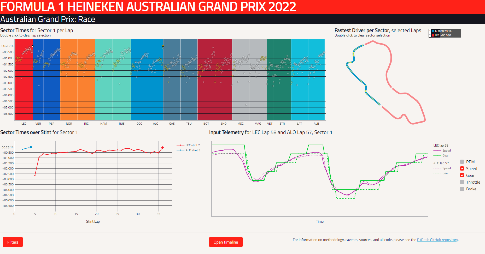

# F1Dash

**F1Dash is an interactive dashboard based on Formula One timing and telemetry data.** Its principal aim is to provide an overview of which drivers/teams are fast during a given session, whilst allowing the user to probe the data and explore the differences in performance between drivers, right down to individual sections of track.
\
\

\
\
A live instance of the app is [hosted on Azure here](https://f1dash.azurewebsites.net/). Please note that this version may not always be running, since there is a small cost incurred by hosting.

The app, from a user perspective, is hopefully quite self-explanatory to anyone who has used an interactive dashboard (e.g. Tableau, Power BI, etc.) before. It is recommended to view the app on desktop rather than mobile; mobile functionality is more limited for practical reasons.

There are four main visual elements:

1. A scatter plot of every driver's times, which can be used to filter down to individual laps.
2. A line graph showing drivers' times as the session or filtered stint progresses.
3. A map of the track, highlighting fastest drivers in each sector, which can be used to filter down to particular sections of track.
4. A graph presenting car telemetry, i.e. speed, gears, throttle, brakes and RPM. Two laps can be compared side-by-side.

A filter pane can be expanded to view specific teams/drivers/compounds, and the desktop version also includes a panel covering track conditions such as weather, track activity, and session status. This visual can also be used to filter the rest of the dashboard to a particular time period.

---

## In brief:

I started this project because I want to better understand the performance of different cars and drivers, particularly under the recently introduced regulations. Formula One's official communications aren't very good for this. For example, following a practice session there's typically just a readout of each driver's fastest laps, but very little information on what programmes they might have been running at the time; hence a driver running qualifying simulations will always look faster than a driver who only ran long-run simulations in that same session.

F1Dash helps provide a lot more context for each driver's lap times in order to build a picture of which drivers are strong in which circumstances in a given session/event. However, I have deliberately stopped short of trying to definitively identify the fastest drivers, for two reasons:
1. There are still many unknowns in the data, which would make creating a predictive model with any kind of nuance very difficult. The biggest problem would probably be the lack of any weight/fuel load data in the source telemetry. This has a huge impact on potential times in practice sessions.
2. Sport thrives on unpredictability. Distilling race outcomes to percentage probabilities ruins a lot of the fun of trying to guess what might happen, as I think has been demonstrated by the AWS contributions to coverage over recent seasons; if you know there's a 90% chance of Verstappen taking pole position, there's not much thrill in watching him pull it off.

The app front end has been built mainly using [Dash](https://dash.plotly.com/introduction) (and the very useful [dash-extensions](https://github.com/thedirtyfew/dash-extensions) and [Dash Bootstrap Components](https://dash-bootstrap-components.opensource.faculty.ai/)) in python, and the back end is SQL Server. This repository includes all code for both.

The telemetry data is sourced via [FastF1](https://github.com/theOehrly/Fast-F1). I could probably have bypassed this library and used the official F1 timing API, however it proved very useful in understanding the raw data.

Additional python libraries used include [pandas](https://pandas.pydata.org/), [SQLAlchemy](https://www.sqlalchemy.org/) and [pyodbc](https://github.com/mkleehammer/pyodbc). All data visuals are built using [plotly](https://plotly.com/python/), the parents of Dash.

---

## In detail:

There are three main components to the project, and I'll briefly describe each: Data load, transforms, and the app itself.

### Data load
The FastF1 API is called on a schedule to check for any new data at source. Managed by a combination of python script and SQL stored procedures, the new data is loaded into SQL Server tables until it's confirmed to be complete, at which point the schedule marks the session as fully loaded and will not check again.

### Transforms
The app requires some heavy data transformations that would be impractical within python at runtime. Instead, python calls a series of stored procedures after a session has been confirmed as fully loaded. These functions create clean datasets from the raw data, creating a relational model, as well as generating a track layout from car position data. *Note: Previous versions included a lot of processing to create track 'zones' from the telemetry data, with the intention of giving a more grandular analysis of performance around a lap. For accuracy and performance (particularly on Azure) reasons, this has been stripped out of the current version for the time being, but may return in an improved form later.*

### Dash app
Dash apps (which are built on Flask) are single threaded, but two additional looping threads are created on startup:
- One thread intermittently checks for new data to load, and manages the process described above.
- The second thread keeps an eye on the size of the file cache, just to make sure it doesn't balloon uncontrollably and overwhelm my Azure instance.

The Dash app itself is managed primarily through callbacks (please refer to the [Dash documentation](https://dash.plotly.com/basic-callbacks) to understand how these work). Some key aspects to call out:
- On startup, the app reads a config table from the back end, which sets some global parameters such as whether to run the lightweight version of the app and how to identify a mobile client.
- On page load, a JavaScript clientside callback gets some useful information for logging, as well as identifying whether the client is on mobile or desktop. The appropriate mobile/desktop layout is rendered accordingly. *Note: Dash Bootstrap Components has been used, but ultimately may have been less help than hindrance as I was aiming for a one-page, fullscreen dashboard on desktop. Bootstrap makes mobile layouts easy, but at the expense of some desktop layouts - I may rewrite the layouts to use non-bootstrap HTML/CSS in the future.*
- To load a session selected by the user, various SQL stored procedures are called to pull the data. This data needs to be shared between callbacks, and 'vanilla' Dash essentially offers two approaches to this: load the datasets into client memory (the datasets are far too large and require constant serialising/deserialising to/from JSON), or load all data for all sessions into the app at startup (which would cause a huge memory overhead). However, dash-extensions offers [a way around this](https://www.dash-extensions.com/transforms/serverside-output-transform), allowing the app to load a selected session to a serverside cache and query it on the fly without any heavy JSON deserialising. As a bonus, if any user requests that same session within a certain time frame, they will query the existing cached version rather than pulling new data from SQL.
- All visuals are built using plotly's lower-level graph_objects library; plotly.express isn't flexible enough for a lot of the presentation and styling required. Slightly different interactions are configured for the visuals depending upon whether the client is on mobile. For example, hover interactions are disabled because they don't work very well on a device without a cursor.

### A note on threading and multiple instances

This app was originally written to run as a single instance, with a single gunicorn worker, and in that case a simple approach to creating additional threads for database updates and cache deletions worked great. However, I'd like to share this dashboard more widely within the F1 community, which requires scaling up/out the app instances, which in turn will cause conflicts as multiple instances each try to run the database updates.

To get around this, the back end database now contains a table in which threads 'check in', to prevent worker 1 on instance A from running a process that worker 2 on instance B is already handling.

If I were to start this project from scratch, I would probably split it into two separate repos entirely, and put the update functionality on its own Azure function app.

---

## Caveats

I cannot vouch for the complete accuracy of the telemetry data used by this app. I have, for example, seen gaps in the input telemetry lasting a significant portion of a lap. The raw timing data appears to suffer from occasional missing data as well, such as 'unknown' tyre compounds that appear in some sessions.

It should also be noted that unclean laps (i.e. a lap unrepresentative of a driver's pace) cannot be identified completely reliably by their very nature. It's simple enough to remove in/out laps and laps under safety cars, etc. However, in order to filter out warm-up laps it was necessary to add a time threshold - it's possible that a particularly hot warm-up lap could slip through the net, and vice versa. In future, I may amend this logic to look for other clues, such as a driver not being at full throttle on straights.

---

## Future plans

Besides some optimisation and code refactoring, there are some additional features I intend to work into this project:

- **Analyse performance through track features:** Sectors are very broad sections of track, always containing a combination of straights and corners of varying speeds, and as such they don't provide much insight into what track features suit a certain driver/car. I would like to explore what is possible in this regard, however the telemetry data is not sufficient to give a reliable times in/out of corners, etc. I may look into some form of proxy indicator, such as minimum speeds through each corner.
- **Improve mobile functionality:** An app like this is not very well suited to mobile, particularly when viewing a lot of data points. There's room for improvement here.
- **Incorporate tyre age/lifespan into visuals:** Rather than an overview of times over a stint, a plot of times vs. tyre age may be more illuminating.
